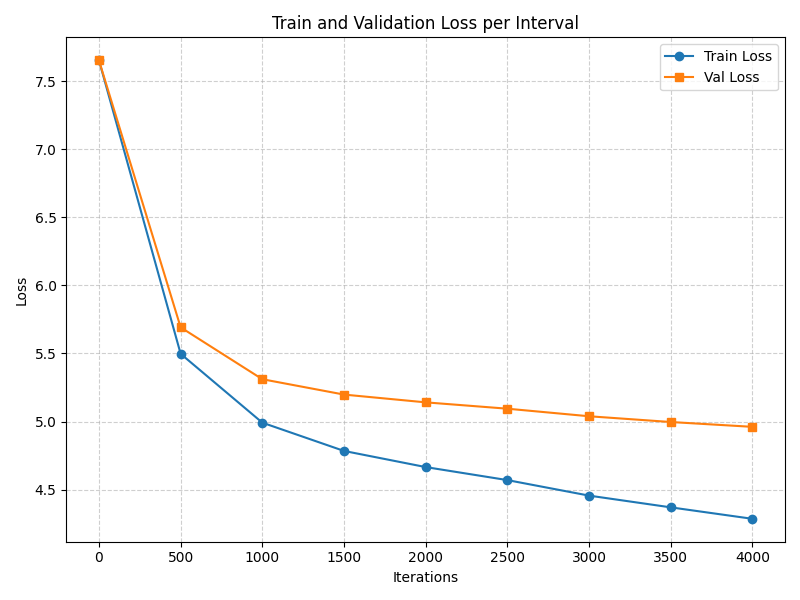
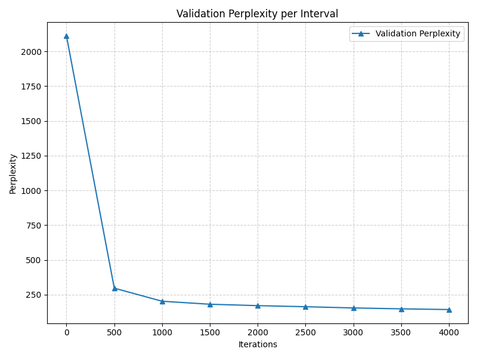

# Token by Token

__Token by Token__ is a project developed by **Jacopo Larizza** and **Alejandro Ruiz**, focused on studying and experimenting with token-level language models. We implemented three types of models: the classic __n-gram__, the __neural n-gram__, and a __GPT-based model__. All models were trained on the __Shakespeare dataset__.  

Model evaluation was conducted both quantitatively, using __perplexity__, and qualitatively, through __text generation__, assessing each model’s ability to produce coherent sequences faithful to the original style. This project also serves as a hands-on exploration of different modeling approaches, from fully NumPy-based neural networks to state-of-the-art transformer architectures.


## Table of Contents
1. [Environment Setup](#environment-setup)
   1. [Clone the repository](#11-clone-the-repository)
   2. [Create virtual environment](#12-create-virtual-environment)
   3. [Install dependencies](#13-install-dependencies)
   4. [Test setup](#14-test-setup)
2. [Project Structure](#2-project-structure)
   1. [Project Tree Explained](#21-project-tree-explained)
3. [How to Use](#3-how-to-use)
   1. [Training Models](#31-training-models)
   2. [Generating Text](#32-generating-text)
4. [Model Results and Evaluation](#4-model-results-and-evaluation)
   1. [Classic n-gram Model](#41-classic-n-gram-model)
   2. [Neural n-gram Model](#42-neural-n-gram-model)
   3. [GPT-based Model](#43-gpt-based-model)

---

## 1. Environment Setup

### 1.1 Clone the repository
```
git clone https://github.com/JLNeuroLab/token-by-token.git
cd token-by-token
```
### 1.2 Create virtual environment
```
python -m venv venv
```
### 1.3 Activate virtual environment
```
.\venv\Scripts\Activate.ps1
```

### 1.4 Install dependencies
```
# Make sure the venv is activated

pip install -r requirements.txt
```

### 1.5 Test setup
```
python main.py
```

## 2. Project Structure
```
📦 LLM_project/
├────── 📂 configs/
├────── 📂 data/
│       ├────── 📂 processed/
│       └────── 📂 raw/
├────── 📂 experiments/
├────── 📂 llm_project/
│       ├────── 📂 bpe/
│       ├────── 📂 models/
│       │       ├────── 📂 gpt/
│       │       ├────── 📂 neural_ngrams/
│       │       └────── 📂 ngrams/
│       └────── 📂 utils/
├────── 📂 tests/
├────── 📄 experiments.txt
├────── 📄 pyproject.toml
├────── 📄 README.md
└────── 📄 requirements.txt
```

### 2.1 Project Tree Explained

- **configs/** → configuration files for experiments and hyperparameters.  
- **data/** → contains raw and preprocessed Shakespeare texts.  
  - **raw/** → original text files.  
  - **processed/** → tokenized and preprocessed datasets ready for training.  
- **experiments/** → logs, saved models, plots, and results from training runs.  
- **llm_project/** → core library of the project:  
  - **bpe/** → Byte Pair Encoding utilities.  
  - **models/** → contains the three model implementations:  
    - **gpt/** → GPT-based transformer model.  
    - **neural_ngrams/** → neural n-gram implemented in NumPy.  
    - **ngrams/** → classic n-gram implementation.  
  - **utils/** → helper functions, dataloaders, and plotting utilities.  
- **tests/** → unit tests to verify the functionality of different components.  
- **experiments.txt** → notes and logs from experiment runs.  
- **pyproject.toml** → project configuration for Python packaging.  
- **README.md** → this document.  
- **requirements.txt** → Python dependencies needed for the project.

> This section helps you understand where to find each component, navigate the codebase efficiently, and know where outputs (models, plots) are stored.

---
## 3. How to use

Token-by-Token is controlled entirely via the command line. There are **two modes**: `train` and `generate`.

---
### Available Models

- **gpt** → GPT-based model  
- **ngram** → Classic n-gram  
- **neural** → Neural n-gram  

---

### 3.1 Training Models

To train a model, use the `train` mode:

```
python main.py train --model <MODEL> [OPTIONS]
```

**Training:**
```
python main.py train --model gpt --max_iters 5000 --dropout 0.1 --embd_dim 128 --n_layer 4
python main.py train --model ngram --n 3 --tune_lambdas --force_retrain
python main.py train --model neural --n 3 --epochs 10 --batch_size 32 --block_size 8 --embedding_dim 16 --force_retrain
```
---

### 3.2 Generating Text

To generate text from a trained model, use the `generate` mode with a prompt.

**Generating text:**
```
python main.py generate --model gpt  --prompt "To be or not to be" --max_new_tokens 100
python main.py generate --model ngram  --prompt "Once upon a time" --max_new_tokens 100
python main.py generate --model neural --prompt "Once upon a time" --max_new_tokens 100
```
---

## 4. Model Results and Evaluation

This section presents the quantitative and qualitative results for all three models: Classic n-gram, Neural n-gram, and GPT-based. Each model includes perplexity, loss curves, vocabulary growth, and observations.

---
### 4.1 Classic n-gram Model

The **classic n-gram model** serves as a baseline. It predicts the next token based on the previous *n* tokens.  

**Implementation Details:**

- The model uses **interpolated n-gram probabilities** to combine different orders of n-grams.  
- The interpolation weights (λ) were **tuned to achieve the best validation perplexity**, improving the model's predictive performance.  


**Results:**

Best Lambdas: [0.1, 0.6, 0.3] with Perplexity: 451.3941

**Plots:**

**Lambdas tuning / Validation Comparison:**  


**Vocabulary Growth:**  


---

### 4.2 Neural n-gram Model

The **neural n-gram model** extends the classic n-gram by learning embeddings for tokens, allowing better generalization over longer contexts.  

**Implementation Details:**

- This model is implemented **entirely in NumPy**, with no additional libraries for neural networks.  
- All operations, including forward passes, backpropagation, and weight updates, are manually coded using NumPy arrays.  
- The network learns embeddings for tokens and predicts the next token based on the previous *n* tokens.  
- This approach allows full control over the model internals and serves as an educational implementation of a neural language model from scratch.

**Results:**

- Perplexity (validation set): TBD  
- Observations: Produces more coherent sequences compared to the classic n-gram; captures some stylistic features of Shakespeare.

**Plots:**

**Training Loss Curve:**  


**Perplexity over Epochs / Validation Comparison:**  


**Vocabulary Growth:**  


---

### 4.3 GPT-based Model

The **GPT-based model** leverages transformers and causal self-attention to model long-range dependencies and generate high-quality text.  

**Results:**

- Perplexity (validation set): TBD  
- Observations: Best performance overall; generates fluent, stylistically faithful text resembling Shakespeare.

**Plots:**

**Training Loss Curve:**  


**Perplexity over Epochs / Validation Comparison:**  


**Vocabulary Growth:**  

