# Token by Token

__Token by Token__ is a project developed by **Jacopo Larizza** and **Alejandro Ruiz**, focused on studying and experimenting with token-level language models. We implemented three types of models: the classic __n-gram__, the __neural n-gram__, and a __GPT-based model__. All models were trained on the __Shakespeare dataset__.  

Model evaluation was conducted both quantitatively, using __perplexity__, and qualitatively, through __text generation__, assessing each model’s ability to produce coherent sequences faithful to the original style. This project also serves as a hands-on exploration of different modeling approaches, from fully NumPy-based neural networks to state-of-the-art transformer architectures.


## Table of Contents
1. [Environment Setup](#environment-setup)
   1. [Clone the repository](#11-clone-the-repository)
   2. [Create virtual environment](#12-create-virtual-environment)
   3. [Install dependencies](#13-install-dependencies)
   4. [Test setup](#14-test-setup)
2. [Project Structure](#2-project-structure)
   1. [Project Tree Explained](#21-project-tree-explained)
3. [How to Use](#3-how-to-use)
   1. [Available Models](#available-models)
   2. [Modes: Assisted vs Manual](#31-modes-assisted-vs-manual)
4. [Model Results and Evaluation](#4-model-results-and-evaluation)
   1. [Classic n-gram Model](#41-classic-n-gram-model)
   2. [Neural n-gram Model](#42-neural-n-gram-model)
   3. [GPT-based Model](#43-gpt-based-model)

---

## 1. Environment Setup

### 1.1 Clone the repository
```
git clone https://github.com/JLNeuroLab/token-by-token.git
cd token-by-token
```
### 1.2 Create virtual environment
```
python -m venv venv
```
### 1.3 Activate virtual environment
```
.\venv\Scripts\Activate.ps1
```

### 1.4 Install dependencies
```
# Make sure the venv is activated

pip install -r requirements.txt
```

### 1.5 Run the project
```
python main.py
```

## 2. Project Structure
```
📦 LLM_project/
├────── 📂 data/
│       ├────── 📂 processed/
│       └────── 📂 raw/
├────── 📂 docs/
├────── 📂 experiments/
├────── 📂 llm_project/
│       ├────── 📂 bpe/
│       ├────── 📂 models/
│       │       ├────── 📂 configs/
│       │       ├────── 📂 gpt/
│       │       ├────── 📂 neural_embeddings/
│       │       ├────── 📂 neural_fast/
│       │       └────── 📂 ngrams/
│       └────── 📂 utils/
├────── 📂 tests/
│       ├────── 📂 bpe/
│       ├────── 📂 gpt/
│       ├────── 📂 ngram/
│       ├────── 📂 test_ngram/
│       └────── 📂 utils/
├────── 📄 main.py
├────── 📄 pyproject.toml
├────── 📄 README.md
└────── 📄 requirements.txt


```

### 2.1 Project Tree Explained
 
- **data/** → contains raw and preprocessed Shakespeare texts.  
  - **raw/** → original text files.  
  - **processed/** → tokenized and preprocessed datasets ready for training.  
- **experiments/** → logs, saved models, plots, and results from training runs.  
- **llm_project/** → core library of the project:  
  - **bpe/** → Byte Pair Encoding utilities.  
  - **models/** → contains the three model implementations:  
    - **configs/** → configuration files for experiments and hyperparameters. 
    - **gpt/** → GPT-based transformer model.  
    - **neural_ngrams/** → neural n-gram implemented in NumPy.  
    - **ngrams/** → classic n-gram implementation.  
  - **utils/** → helper functions, dataloaders, and plotting utilities.  
- **tests/** → unit tests to verify the functionality of different components.  
- **experiments.txt** → notes and logs from experiment runs.  
- **main.py** → main entry point of the project; used to train models and generate text.  
- **pyproject.toml** → project configuration for Python packaging.  
- **README.md** → this document.  
- **requirements.txt** → Python dependencies needed for the project.

> This section helps you understand where to find each component, navigate the codebase efficiently, and know where outputs (models, plots) are stored.

---
## 3. How to Use
Token-by-Token is fully **command-line driven**. You can run it in **two modes**: `manual` or `assisted`. 
The main entry point is:

```
python -m main.py
```
---
### Available Models

- **gpt** → GPT-based model  
- **ngram** → Classic n-gram  
- **neural** → Neural n-gram  

--- 
### 3.1 Modes: Assisted vs Manual

**Manual Mode** – You type full commands. Ideal for experienced users or reproducible experiments.
```
Token console > Console mode (manual / assisted / exit) [manual if blank]: <-
```
**Example usage:**
```
Train examples

train --model gpt --max_iters 5000 --dropout 0.1 --embd_dim 128 --n_layer 4
train --model ngram --n 3 --tune_lambdas --force_retrain
train --model neural --n 3 --epochs 10 --batch_size 32 --block_size 8 --embedding_dim 16 --force_retrain
```
---
```
Generate examples

generate --model gpt --prompt "To be or not to be" --max_new_tokens 100
generate --model ngram --prompt "Once upon a time" --max_new_tokens 100
generate --model neural_fast --prompt "Boss, I'm tired" --max_new_tokens 100
```
### 3.2 Assisted Mode

**Assisted Mode** – You are guided step-by-step through a wizard. This is ideal for beginners or users who want to quickly configure training or generation without memorizing full command-line arguments.  

In assisted mode, the program will prompt you for each setting, offering default values and valid options. You can also type `back` to go to the previous step, or `exit` to quit the wizard.

**Example usage:**

#### Start Assisted Mode
```
Token console > Console mode (manual / assisted / exit) [manual if blank]: assisted <-
```
## 4. Model Results and Evaluation

This section presents the quantitative and qualitative results for all three models: Classic n-gram, Neural embeddings, and GPT-based. Each model includes perplexity, loss curves, vocabulary growth, and observations.

---
### 4.1 Classic n-gram Model

The **classic n-gram model** serves as a baseline. It predicts the next token based on the previous *n* tokens.  

**Implementation Details:**

- The model uses **interpolated n-gram probabilities** to combine different orders of n-grams.  
- The interpolation weights (λ) were **tuned to achieve the best validation perplexity**, improving the model's predictive performance.  

**Parameters**
- Best Lambdas: [0.1, 0.6, 0.3]

**Results:**
- Perplexity: 451.3941

**Plots:**

**Lambdas tuning / Validation Comparison:**  
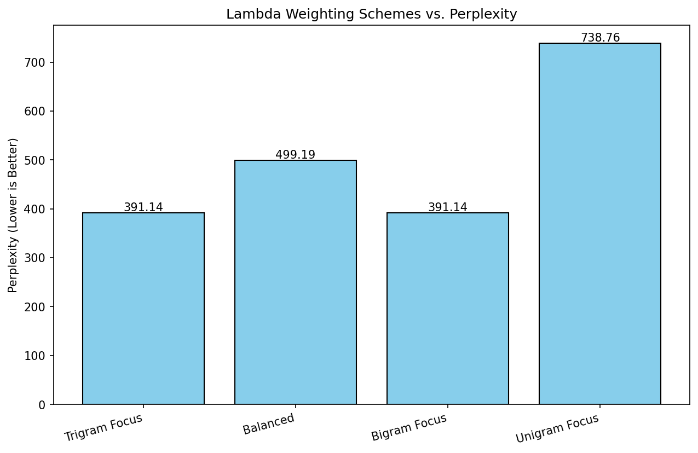

---

#### BPE Vocabulary Search (max k)

To evaluate the impact of BPE vocabulary size, we trained the n-gram model with different values of *k* (number of merge operations).

**Results:**

| k (BPE merges) | Validation Perplexity |
|----------------|------------------------|
| 200            | **138.43**             |
| 600            | 353.42                 |
| 1000           | 575.29                 |

**Observations:**
- The optimal vocabulary size was found at *k=200*, which achieved the lowest perplexity.  
- Larger vocabularies (k=600 and k=1000) degraded performance, likely because the model cannot generalize well with too many rare subword units.  
- We therefore selected **k=200** as the reference vocabulary size for subsequent GPT experiments.

**Plots**

**K tuning / Validation Comparison:**  
.png)

---
#### Text generated examples  
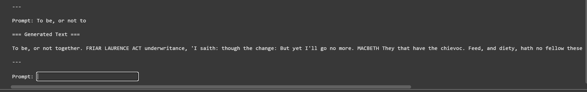

---
### 4.2 Neural Embedding Model

The **neural n-embedding model** extends the classic n-gram by learning embeddings for tokens, allowing better generalization over longer contexts.  

**Implementation Details:**

- This model is implemented **entirely in NumPy**, with no additional libraries for neural networks.  
- All operations, including forward passes, backpropagation, and weight updates, are manually coded using NumPy arrays.  
- The network learns embeddings for tokens and predicts the next token based on the previous *n* tokens.  
- **Early stopping** is implemented with a configurable **patience** parameter: training halts if validation loss does not improve for a set number of epochs.  
- **Checkpointing** ensures that the best model (lowest validation loss) is saved during training, allowing safe recovery and selection of the optimal parameters.  
- This approach allows full control over the model internals and serves as an educational implementation of a neural language model from scratch.
<div style="display:flex; gap: 50px;">

<div>
<h4>Model Hyperparameters</h4>
<table>
<tr><th>Parameter</th><th>Value</th></tr>
<tr><td>Embedding Dim</td><td>256</td></tr>
<tr><td>Block Size</td><td>8</td></tr>
<tr><td>N-gram Order (n)</td><td>3</td></tr>
</table>
</div>

<div>
<h4>Training Hyperparameters</h4>
<table>
<tr><th>Parameter</th><th>Value</th></tr>
<tr><td>Epochs</td><td>10</td></tr>
<tr><td>Patience</td><td>3</td></tr>
<tr><td>Batch Size</td><td>64</td></tr>
<tr><td>Learning Rate</td><td>3e-4</td></tr>
</table>
</div>

</div>

**C. Notes / Special Features**

- Early stopping with `patience=3`
- Checkpointing to save the best model (lowest validation loss)
- Fully NumPy-based implementation

---

**Results:**

- Perplexity (validation set): 62.4458
- Observations: Produces more coherent sequences compared to the classic n-gram; captures some stylistic features of Shakespeare.

**Plots:**

**Training Loss Curve:**  
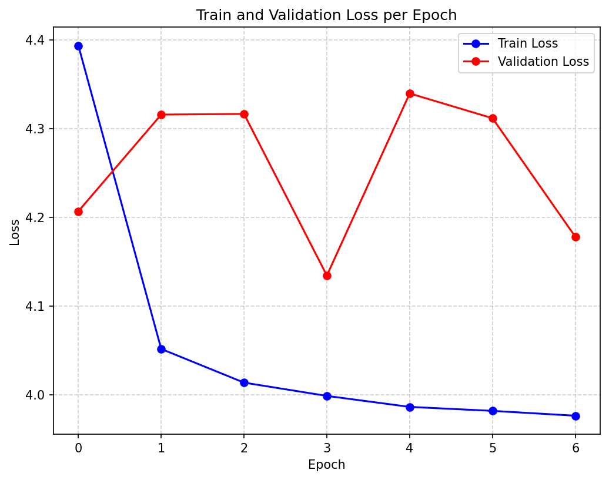

**Perplexity over Epochs / Validation Comparison:**  
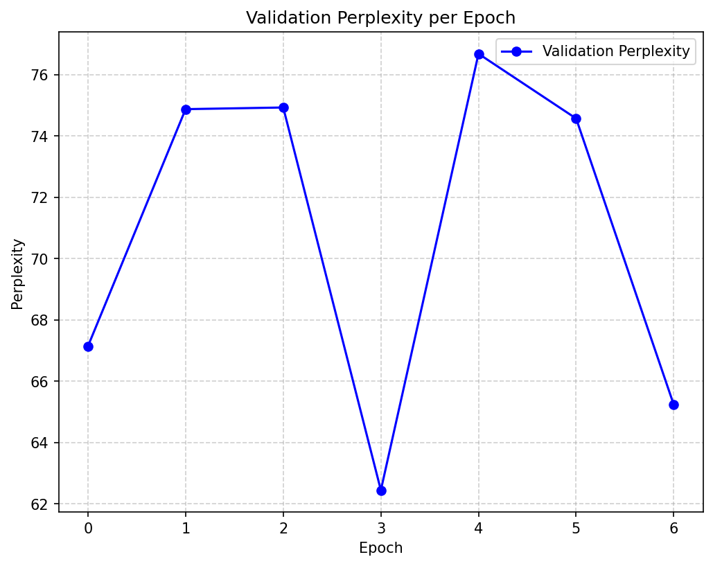

---
#### Text generated examples 
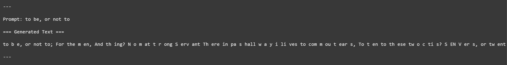

---

### 4.3 GPT-based Model

The **GPT-based model** leverages transformers and causal self-attention to model long-range dependencies and generate high-quality text.
<div style="display:flex; gap: 50px;">

**GPT Configuration
<div>
<h4>Model Hyperparameters</h4>
<table>
<tr><th>Parameter</th><th>Value</th></tr>
<tr><td>Embedding Dim</td><td>384</td></tr>
<tr><td>Block Size</td><td>64</td></tr>
<tr><td>Number of Layers</td><td>4</td></tr>
<tr><td>Number of Heads</td><td>6</td></tr>
<tr><td>Dropout</td><td>0.2</td></tr>
</table>
</div>

<div>
<h4>Training Hyperparameters</h4>
<table>
<tr><th>Parameter</th><th>Value</th></tr>
<tr><td>Iterations</td><td>5000</td></tr>
<tr><td>Batch Size</td><td>64</td></tr>
<tr><td>Learning Rate</td><td>3e-4</td></tr>
<tr><td>Weight Decay</td><td>0.0</td></tr>
<tr><td>Gradient Clipping</td><td>None</td></tr>
<tr><td>Eval Interval</td><td>500</td></tr>
</table>
</div>

</div>

**C. Notes / Special Features**

- Causal self-attention (transformer architecture)
- Uses **BPE vocabulary size `k=200`** (selected from n-gram experiments)  
- Strong performance in validation perplexity and text quality  


**Results:**

- Perplexity (validation set): 14.53
- Observations: Best performance overall; generates fluent, stylistically faithful text resembling Shakespeare.
---
#### GPT Experiments – Selected Models

To evaluate the GPT models, we selected the baseline and the best experiments trained for the same number of iterations (5,000) for a fair comparison, plus an additional long-training experiment showing the potential of extended training.  

**Note:** All GPT experiments use **max_k=200**, the BPE vocabulary size found optimal during the classic n-gram experiments.

| Rank | Experiment Name           | Embedding Dim | Layers | Dropout | Learning Rate | Max k | Final Val Loss | Notes |
|------|---------------------------|---------------|--------|---------|---------------|-------|----------------|-------|
| 0    | A_Baseline                | 128           | 4      | 0.2     | 3e-4           | 200   | 2.9905         | Baseline for comparison |
| 1    | B_Embedding_Sweep_384     | 384           | 4      | 0.2     | 3e-4           | 200   | 2.6765         | Larger embedding improved performance |
| 2    | B_Embedding_Sweep_256     | 256           | 4      | 0.2     | 3e-4           | 200   | 2.7401         | Moderate embedding size, good trade-off |
| 3    | E_LearningRate_Sweep_High | 128           | 4      | 0.2     | 6e-4        | 200   | 2.8885         | Higher learning rate slightly improves results |

**Additional Note:**  
- `Z_Long_Training_Best_Guess` (15,000 iterations, embedding 256, 6 layers) achieved the **lowest validation loss (2.6106)**, but the improvement is largely due to the longer training schedule.
- All other experiments were run for 5,000 iterations to allow a **fair comparison of architecture and hyperparameters**.

---
#### Text generated examples    
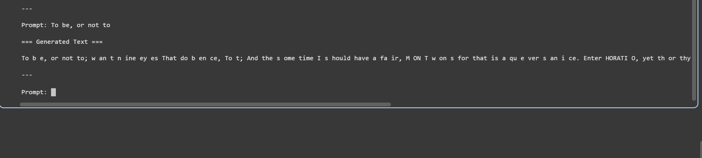

--- 
#### Plots – Selected GPT Experiments

**Baseline (A_Baseline)**  
**Training Loss Curve** – shows the decrease in training loss over 5,000 iterations.  
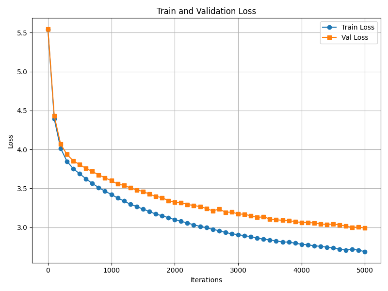  

**Validation Perplexity** – tracks model perplexity on the validation set over training iterations.  
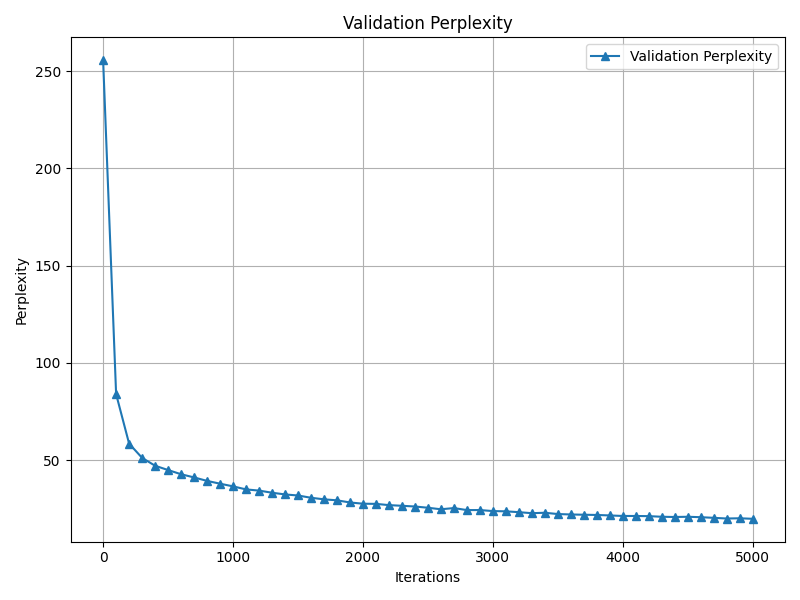  

---

**B_Embedding_Sweep_384**  
**Training Loss Curve** – demonstrates faster convergence thanks to the larger embedding size.  
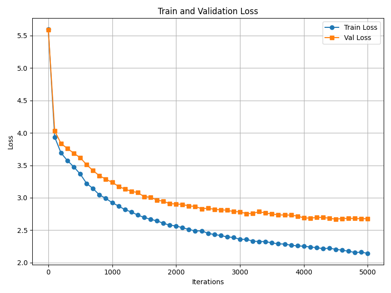  

**Validation Perplexity** – shows how validation perplexity improves with larger embeddings.  
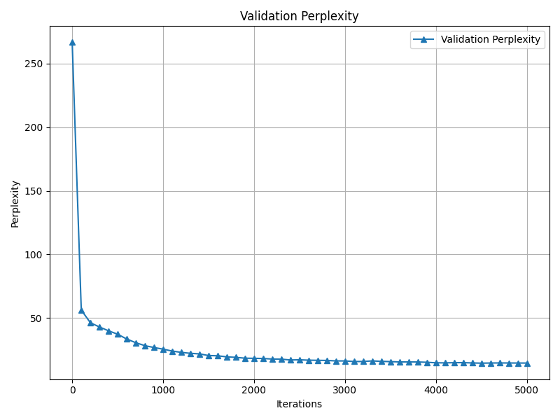  

---

**B_Embedding_Sweep_256**  
**Training Loss Curve** – visualizes training dynamics with moderate embedding size.  
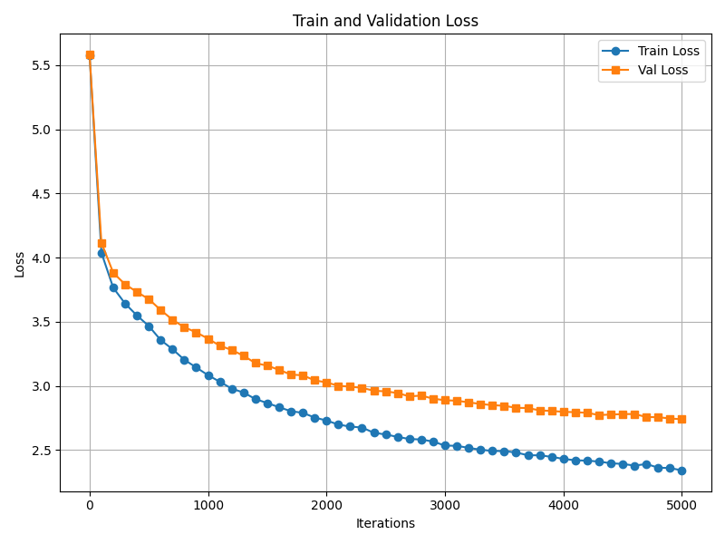  

**Validation Perplexity** – tracks perplexity, showing a good trade-off between performance and model size.  
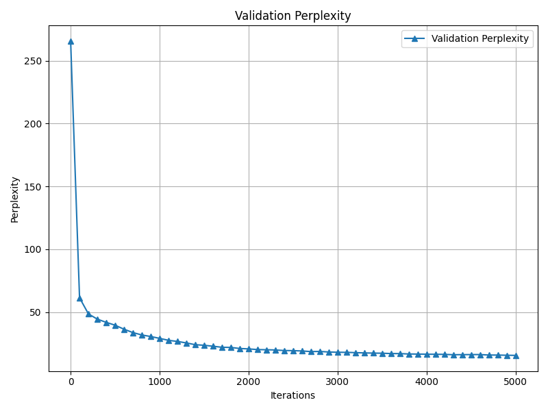  

---

**E_LearningRate_Sweep_High**  
**Training Loss Curve** – illustrates the effect of a higher learning rate on convergence.  
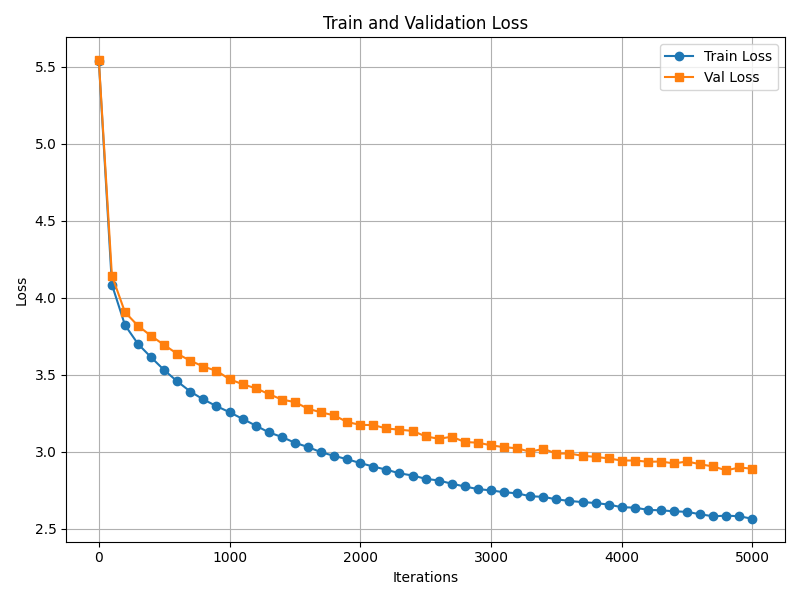  

**Validation Perplexity** – shows validation perplexity dynamics with a slightly higher learning rate.  
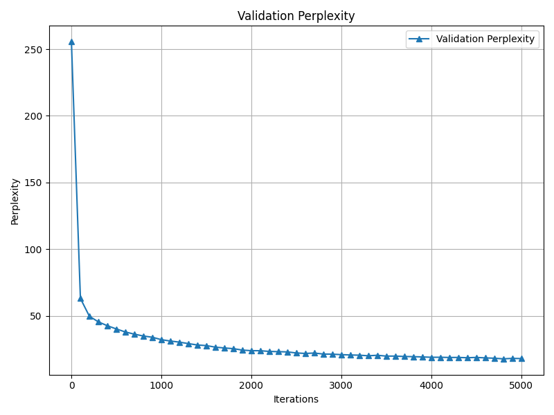  

---

**Z_Long_Training_Best_Guess (Extra Long Training)**  
**Training Loss Curve** – demonstrates long-term convergence and continued improvement over 15,000 iterations.  
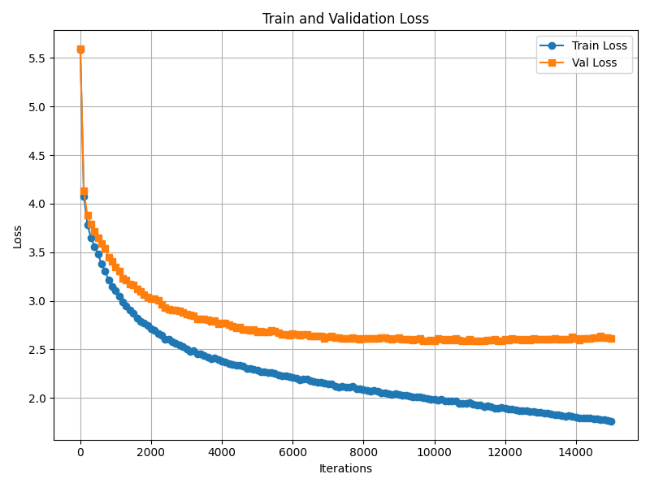  

**Validation Perplexity** – lowest validation perplexity achieved due to extended training.  
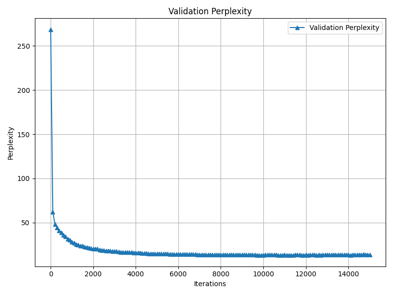  
